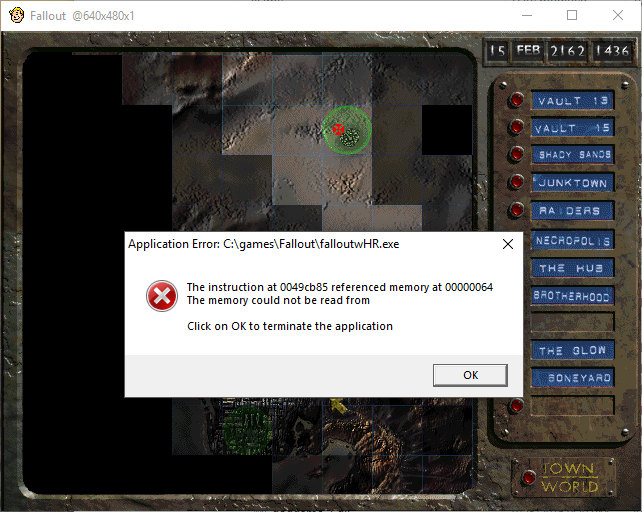
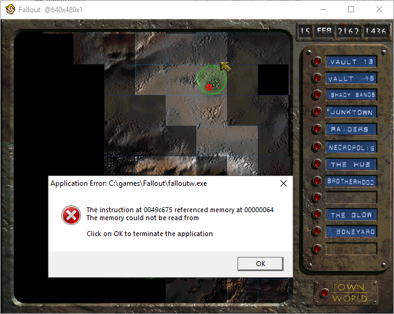

# Fallout 1 


There is a bugged event walking on the global map in the path between the
Boneyard Downton and The HUB, which leads to an `ACCESS_VIOLATION` due to a null
pointer. This patch fixes this bug in the high resolution version aswell in the
normal one.

This patch fixes the following bugs:

 * `The instruction at 0049cb85 referenced memory at 00000064 The memory could not be read from` on `falloutwHR.exe`.
 * `The instruction at 0049c675 referenced memory at 00000064 The memory could not be read from` on `falloutw.exe`.

# Applying the patch

Just compile (`gcc patch-<your-version>.c -o patch.exe`) and copy it to your
fallout folder and run the respective for your version, but before check the
hashes to confirm your version.

 * `falloutw.exe` 
    * Patch: `patch-normal.c`
    * Original hash `2e5366621972b52c27fdf5576b9cb79c`
    * Patched hash `8f86405e27199253597960845d1915c7`
 * `falloutwHR.exe`
    * Patch: `patch-hr.c`
    * Original hash `212d7b66f75b3c19acbbcb818e6f13bf`
    * Patched hash `37116638bc3d951bb540acc30ef83427`

Bellow there is an explanation of what changed in the files, if you are paranoid
and want to know what is happening to your binaries.

# Explanation for Fallout High Resolution patch



This explanation is for the file `falloutwHR.exe` with the respetive MD5 hash
`212d7b66f75b3c19acbbcb818e6f13bf`. The final patch can be found
[here](/patch-hr.patch).

The null pointer ocurring at `0x0049CB85` is the collateral effect of a invalid
null pointer being passed from the function at `0x00490E84`. This function
handle the random events in the game, and it is where this bug starts. Bellow
the code:

```assembly
00490E84 | push ebx                          |
00490E85 | push ecx                          | This function is called for a lot of reasons on the global map
00490E86 | push edx                          | Handle some data structures and call some specialized methods for
00490E87 | push esi                          | handling to events on their own way.
00490E88 | push edi                          |
00490E89 | push ebp                          |
00490E8A | call 0x00491BE0                   |
00490E8F | mov ebx,dword ptr ds:[662F6C]     |
00490E95 | mov edi,eax                       |
00490E97 | xor edx,edx                       |
00490E99 | test ebx,ebx                      |
00490E9B | je 0x00490EF2                     |
00490E9D | mov ebx,dword ptr ds:[662F6C]     | Begin of the loop
00490EA3 | cmp edi,dword ptr ds:[ebx]        |
00490EA5 | jb 0x00490EF2                     | Go to the end of the loop
00490EA7 | test edx,edx                      |
00490EA9 | jne 0x00490EF2                    | Go to the end of the loop
00490EAB | imul esi,dword ptr ds:[ebx+4],18  |
00490EAF | mov eax,dword ptr ds:[ebx+10]     |
00490EB2 | mov edx,dword ptr ds:[ebx+C]      |
00490EB5 | mov dword ptr ds:[662F6C],eax     |
00490EBA | mov eax,dword ptr ds:[ebx+8]      | <==== Our bug will be triggered because EAX will be 0
00490EBD | call dword ptr ds:[esi+5077EC]    | <==== Call the Handler for the event
00490EC3 | mov esi,dword ptr ds:[ebx+4]      |
00490EC6 | mov edx,eax                       |
00490EC8 | imul eax,esi,18                   |
00490ECB | mov ebp,dword ptr ds:[eax+5077F0] |
00490ED1 | mov ecx,ebx                       |
00490ED3 | test ebp,ebp                      |
00490ED5 | je 0x00490EE2                     |
00490ED7 | mov esi,eax                       |
00490ED9 | mov eax,dword ptr ds:[ebx+C]      |
00490EDC | call dword ptr ds:[esi+5077F0]    |
00490EE2 | mov eax,ecx                       |
00490EE4 | call 0x004AF2A8                   |
00490EE9 | cmp dword ptr ds:[662F6C],0       | If there are any event event left to process
00490EF0 | jne 0x00490E9D                    |   Get back to the begin of the loop
00490EF2 | mov eax,edx                       | End of the loop
00490EF4 | pop ebp                           |
00490EF5 | pop edi                           |
00490EF6 | pop esi                           |
00490EF7 | pop edx                           |
00490EF8 | pop ecx                           |
00490EF9 | pop ebx                           |
00490EFA | ret                               |
```

At `0x00490EBD` the `EBX` register will point the address of the current data
structure to handle the event. When the current loop element is pointing to the
bogus event `ESI` will be `0x90` will point to `0x00428204`, the routine which
will handle this event.

Bellow the function located at `0x00428204`:

```assembly
00428204 | push ebx                          |
00428205 | push ecx                          |
00428206 | push esi                          |
00428207 | push edi                          |
00428208 | mov edi,eax                       |
0042820A | mov esi,edx                       |
0042820C | cmp dword ptr ds:[edx+4],0        |
00428210 | jne 0x0042824F                    |
00428212 | mov eax,8                         |
00428217 | call 0x004AF140                   |
0042821C | mov ebx,eax                       |
0042821E | test eax,eax                      |
00428220 | je 0x00428259                     |
00428222 | mov edx,0x004280E8                |
00428227 | mov eax,6                         |
0042822C | mov ecx,6                         |
00428231 | call 0x00490F44                   |
00428236 | mov edx,dword ptr ds:[esi]        |
00428238 | mov eax,0x005C4900                |
0042823D | mov dword ptr ds:[ebx],edx        |
0042823F | mov edx,edi                       |
00428241 | mov dword ptr ds:[ebx+4],1        |
00428248 | call 0x00490D40                   |
0042824D | mov eax,edi                       | EDI is NULL
0042824F | mov ebx,dword ptr ds:[esi+4]      |
00428252 | mov edx,dword ptr ds:[esi]        |
00428254 | call 0x00428100                   | here EAX=0
00428259 | mov eax,1                         |
0042825E | pop edi                           |
0042825F | pop esi                           |
00428260 | pop ecx                           |
00428261 | pop ebx                           |
00428262 | ret                               |
```

At `0x00490EBA` `EBX+8` points to a `NULL`, and it is stored into `EAX`, this is
what is causing troubles on `0x00428100`. The game works fine just bypassing
`0x00428254` if `EAX` is `NULL`, the event being bypassed is just some empty map
and the dweller complaining that it needs more skill for survival. There is a
good cave near `0x0041A6D1` that is possible to use. As we don't have much space
for comparing `EAX` with 0, we will need to jump to toe code cave and do it
there and then return where we stopped.

The following piece of code will be transplanted to the code cave:

```assembly
0042824F | mov ebx,dword ptr ds:[esi+4]
00428252 | mov edx,dword ptr ds:[esi]
00428254 | call 0x00428100
```

And will be replaced with this hook to our cave:

```assembly
0042824D | mov eax,edi
0042824F | jmp 0x0041A6D1
00428254 | nop
00428255 | nop
00428256 | nop
00428257 | nop
00428258 | nop
00428259 | mov eax,1
0042825E | pop edi
0042825F | pop esi
```

And finally, the bugfix in the code cave:

```assembly
0041A6D1 | mov ebx,dword ptr ds:[esi+4]
0041A6D4 | mov edx,dword ptr ds:[esi]
0041A6D6 | cmp eax,0
0041A6D9 | je 0x0041A6E0
0041A6DB | call 0x00428100
0041A6E0 | jmp 0x00428254
```

# Explanation for the non-high resolution version



This explanation is for the normal Fallout 1 executable, named
`falloutw.exe` with the respetive MD5 hash
`2e5366621972b52c27fdf5576b9cb79c`. The final patch can be found
[here](/patch-normal.patch).

Everything is the same as the high resolution version, here is the function to
be patched as described:

```assembly
00427F94 | push ebx
00427F95 | push ecx
00427F96 | push esi
00427F97 | push edi
00427F98 | mov edi,eax
00427F9A | mov esi,edx
00427F9C | cmp dword ptr ds:[edx+4],0
00427FA0 | jne 0x00427FDF
00427FA2 | mov eax,8
00427FA7 | call 0x004AEC30
00427FAC | mov ebx,eax
00427FAE | test eax,eax
00427FB0 | je 0x00427FE9
00427FB2 | mov edx,0x00427E78
00427FB7 | mov eax,6
00427FBC | mov ecx,6
00427FC1 | call 0x00490AA4
00427FC6 | mov edx,dword ptr ds:[esi]
00427FC8 | mov eax,0x005C4900
00427FCD | mov dword ptr ds:[ebx],edx
00427FCF | mov edx,edi
00427FD1 | mov dword ptr ds:[ebx+4],1
00427FD8 | call 0x004908A0
00427FDD | mov eax,edi
00427FDF | mov ebx,dword ptr ds:[esi+4]
00427FE2 | mov edx,dword ptr ds:[esi]
00427FE4 | call 0x00427E90
00427FE9 | mov eax,1
00427FEE | pop edi
00427FEF | pop esi
00427FF0 | pop ecx
00427FF1 | pop ebx
00427FF2 | ret
```

For this executable the code cave is located at `0x0041A5C1`. The patched to
hook it to our bugfix:

```assembly
00427FD8 | call 0x004908A0
00427FDD | mov eax,edi
00427FDF | jmp 0x0041A5C1
00427FE4 | nop
00427FE5 | nop
00427FE6 | nop
00427FE7 | nop
00427FE8 | nop
00427FE9 | mov eax,1
00427FEE | pop edi
00427FEF | pop esi
```

And the following code is the fix located at the code cave:

```assembly
0041A5C0 | nop
0041A5C1 | mov ebx,dword ptr ds:[esi+4]
0041A5C4 | mov edx,dword ptr ds:[esi]
0041A5C6 | cmp eax,0
0041A5C9 | je 0x0041A5D0
0041A5CB | call 0x00427E90
0041A5D0 | jmp 0x00427FE4
```
